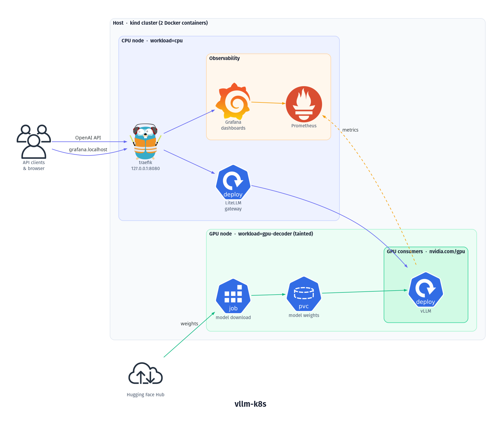

# vllm-k8s

Serving an LLM with [vLLM](https://github.com/vllm-project/vllm) on Kubernetes, behind a
[LiteLLM](https://github.com/BerriAI/litellm) gateway, with GPU-aware monitoring. Runs locally on a
single machine with one NVIDIA GPU, as a two-node [kind](https://kind.sigs.k8s.io/) cluster created
by [nvkind](https://github.com/NVIDIA/nvkind).

- Model: `Qwen/Qwen3-4B`, served as `qwen3-4b` (OpenAI-compatible API)
- Entry point: `http://127.0.0.1:8080/v1` (API), `http://grafana.localhost:8080` (Grafana)

## Architecture



The host's Docker runs two kind nodes as containers; Docker cgroup limits split the host's CPUs and
memory between them, and only the GPU node gets the GPU. The GPU node is tainted, so only pods
that tolerate `workload=gpu-decoder` (vLLM, the model download, GPU Operator daemons) land there.

- **Requests:** client → `127.0.0.1:8080` (kind port mapping → NodePort) → traefik → LiteLLM →
  vLLM. A NetworkPolicy only lets LiteLLM (and Prometheus) reach vLLM.
- **Model:** a Job downloads the weights from Hugging Face onto a PVC; vLLM mounts it read-only.
- **Metrics:** Prometheus scrapes vLLM's `/metrics` and the DCGM exporter (GPU), plus cAdvisor,
  kube-state-metrics and node-exporter; Grafana is served at `grafana.localhost:8080`.

The diagram is generated from `docs/architecture.py`
([diagrams](https://github.com/mingrammer/diagrams), needs Graphviz):

```bash
uv run --no-project --with diagrams python docs/architecture.py
```

### Components

| Component | Namespace | Node | Installed by | Purpose |
|---|---|---|---|---|
| vLLM | `llm` | worker | `deploy/deploy.sh` (`components/vllm`) | Model server, OpenAI API on :8000 |
| model-download Job | `llm` | worker | `deploy/deploy.sh` (`model-download/`) | `hf download` into the `model-weights` PVC |
| LiteLLM | `llm` | control-plane | `deploy/deploy.sh` (`components/litellm`) | Gateway in front of vLLM, exposed via Ingress |
| vLLM ServiceMonitor + NetworkPolicy | `llm` | – | `deploy/deploy.sh` (`components/vllm-monitoring`) | Lets Prometheus scrape vLLM `/metrics` |
| traefik | `traefik` | control-plane | `setup-infra.sh` (Helm) | Ingress controller on NodePort 30080 |
| NVIDIA GPU Operator | `gpu-operator` | both | `setup-infra.sh` (Helm) | Device plugin, DCGM exporter, GPU feature discovery (driver + toolkit come from host/nvkind) |
| kube-prometheus-stack | `monitoring` | control-plane (node-exporter: both) | `setup-infra.sh` (Helm) | Prometheus, Grafana, Alertmanager, operator, kube-state-metrics |
| Grafana dashboards | `monitoring` | – | `setup-infra.sh` (`observability/dashboards`) | "Workloads: CPU / RAM / GPU" and "vLLM" |
| descheduler | `kube-system` | control-plane | `setup-infra.sh` (Helm) | Evicts pods that failed admission after a node restart (see below) |

## Repository layout

```
infra/local/                 kind cluster + cluster-wide services (kind-specific)
  install-deps.sh            NVIDIA Container Toolkit, kind, nvkind, kubectl, helm, k9s, uv
  setup-infra.sh             cluster, cgroup limits, GPU Operator, traefik, descheduler, monitoring
  teardown-infra.sh          deletes the cluster (keeps PVC data in /home/kind/storage)
  common.sh                  versions, node sizes, shared helpers
  kind-config.yaml           node layout, labels, taints, system-reserved, port mapping
  *-values.yaml              Helm values per chart
deploy/                      the LLM stack (kustomize)
  base/                      namespace only
  components/vllm/           vLLM Deployment, Service, PVC, engine config (vllm-config.yaml)
  components/litellm/        LiteLLM Deployment, Service, Ingress, NetworkPolicy
  components/vllm-monitoring/ ServiceMonitor + NetworkPolicy for Prometheus (needs the CRDs)
  overlays/local-kind/       picks the components, adds kind specifics + hf-token secret
  model-download/            Job that downloads the model onto the PVC
  deploy.sh                  preflight, PVC, download, apply, smoke test
observability/dashboards/    Grafana dashboards as code (ConfigMaps via kustomize)
bench/                       load-test scripts (chunked prefill comparison)
docs/                        notes and experiments
```

## Quick start

Prerequisites: Linux, Docker Engine, Go, NVIDIA driver on the host, and a Hugging Face token.

```bash
infra/local/install-deps.sh                       # once
infra/local/setup-infra.sh                        # cluster + GPU Operator + traefik + descheduler + monitoring
echo "HF_TOKEN=hf_..." > deploy/overlays/local-kind/hf.env   # gitignored
deploy/deploy.sh                                  # download model, deploy vLLM + LiteLLM, smoke test
```

Try it:

```bash
curl http://127.0.0.1:8080/v1/chat/completions -H 'Content-Type: application/json' \
  -d '{"model": "qwen3-4b", "messages": [{"role": "user", "content": "Say hi /no_think"}]}'
```

Grafana: open `http://grafana.localhost:8080`, user `admin`, password:

```bash
kubectl -n monitoring get secret kps-grafana -o jsonpath='{.data.admin-password}' | base64 -d; echo
```

## Day-to-day

| Task | Command |
|---|---|
| Apply manifest changes in `deploy/` | `SKIP_DOWNLOAD=1 deploy/deploy.sh` (or `kubectl apply -k deploy/overlays/local-kind`) |
| Change vLLM engine settings | edit `deploy/components/vllm/vllm-config.yaml`, then apply (the ConfigMap hash rolls the pod) |
| Update dashboards | edit `observability/dashboards/*.json`, then `kubectl apply -k observability/dashboards` |
| Upgrade one Helm release | `source infra/local/common.sh` and run that release's `helm upgrade` from `setup-infra.sh` |
| Tear down | `infra/local/teardown-infra.sh` |

`kubectl apply` never deletes objects removed from the manifests; delete renamed or dropped ones by
hand.

## Gotchas

- **One GPU, exclusive.** `nvidia.com/gpu: 1` is a whole GPU; vLLM holds it, so any other GPU pod
  (including `setup-infra.sh`'s `nvidia-smi` test) stays Pending while vLLM runs. Re-running
  `setup-infra.sh` on a live cluster therefore fails at that step; upgrade Helm releases
  individually instead.
- **Restarts and GPU admission.** After a host or Docker restart the kubelet re-admits pods before
  the device plugin re-registers the GPU, so vLLM can fail with `UnexpectedAdmissionError`. The
  descheduler evicts such pods when their phase is `Failed`; pods stuck in `Unknown` need
  `kubectl delete pod`.
- **Node metrics are host metrics.** kind nodes share the host's `/proc`, so node-exporter reports
  all 16 host CPUs on both nodes. Per-pod CPU and memory (cAdvisor) and GPU metrics (DCGM) are
  accurate. The kubelet's capacity also ignores the Docker cpuset; `system-reserved` in
  `kind-config.yaml` is what brings allocatable down to the real node size. `check_nodes` warns
  when the two differ.
- **NetworkPolicy is L4.** The policy that admits Prometheus opens all of vLLM's port 8000 to it,
  not only `/metrics`.
- **Per-pod GPU metrics are per device.** DCGM labels a GPU's metrics with the pod it's allocated
  to. With GPU time-slicing every sharing pod would show the same values.
- **vLLM preallocates VRAM** (`gpu-memory-utilization: 0.92`), so VRAM used stays near full; the
  vLLM dashboard's KV-cache usage shows actual use.
- **Model weights outlive teardown but are not reused.** They stay in `/home/kind/storage`, but a
  new cluster's PVC gets a new `pvc-<uid>` folder, so the model is downloaded again. Delete old
  folders by hand.
